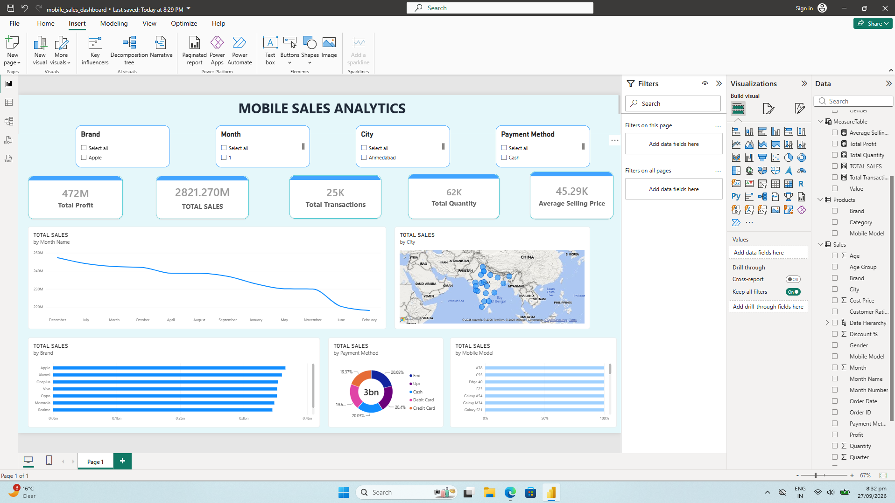

# 📊 Mobile Sales Analysis Dashboard

## 📌 Project Overview

This project presents an interactive **Power BI dashboard** developed to analyze mobile sales performance.

The dashboard provides a consolidated view of key business metrics including **Total Sales, Total Profit, Total Transactions, Total Quantity, and Average Selling Price**.

It also allows users to explore sales performance by **brand, month, city, payment method, and other dimensions**.

---

## 🎯 Project Objectives

The main objectives of this project are:

- Analyze overall mobile sales performance
- Track total sales and profit
- Monitor transaction volume
- Analyze quantity sold
- Compare sales across mobile brands
- Analyze monthly sales trends
- Analyze sales across different locations
- Analyze payment methods
- Provide interactive filtering for business analysis

---

## 🛠️ Tools & Technologies

- **Power BI Desktop**
- **Power Query**
- **DAX**
- **Data Modeling**
- **Data Visualization**

---

## 📊 Key Performance Indicators

The dashboard contains the following KPI cards:

| KPI | Purpose |
|---|---|
| Total Profit | Measures overall profit generated |
| Total Sales | Measures overall sales value |
| Total Transactions | Measures transaction volume |
| Total Quantity | Measures units sold |
| Average Selling Price | Measures average selling price |

---

## 🎛️ Dashboard Filters

Interactive slicers are provided for dimensions such as:

- Brand
- Month
- City
- Payment Method

These filters allow users to dynamically explore the dashboard.

---

## 📈 Dashboard Visualizations

### Monthly Sales Trend

A time-based visualization is used to analyze how mobile sales change across months.

### Geographic Analysis

A map visualization is used to analyze sales across different locations.

### Brand Analysis

Sales performance is compared across different mobile brands.

### Payment Method Analysis

The dashboard provides a breakdown of sales based on payment methods.

---

## 🧹 Data Preparation

The dataset was prepared using **Power Query** before creating the dashboard.

The data preparation process includes data cleaning, transformation, data type handling, and creation of fields required for analysis.

Detailed transformation steps will be documented as part of this project.

---

## 🧮 DAX Measures

DAX measures were created to calculate the key business metrics used in the dashboard.

The actual DAX formulas and explanations will be documented separately based on the measures created in the Power BI project.

---

## 🖼️ Dashboard Preview



---

## 🔄 Project Workflow

```text
Raw Sales Data
↓
Power Query
↓
Data Cleaning & Transformation
↓
Data Model
↓
DAX Measures
↓
Power BI Visualizations
↓
Interactive Dashboard
↓
Business Insights
